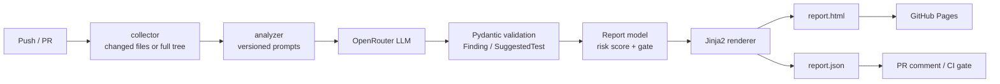

<div align="center">

# ◆ aiqa — AI QA Copilot for CI/CD

**Ship code. The AI reviews it.**

An open-source pipeline that reviews every changed file with an LLM, surfaces real
defects and reliability risks, generates the tests you're missing, and publishes a
shareable HTML report — right inside GitHub Actions. Free to run.

[](https://github.com/Priya123z/AI-pipeline-report/actions/workflows/tests.yml)
[](https://github.com/Priya123z/AI-pipeline-report/actions/workflows/aiqa-scan.yml)
[](https://priya123z.github.io/AI-pipeline-report/)


### [🌐 Live landing page](https://priya123z.github.io/AI-pipeline-report/) &nbsp;·&nbsp; [📊 Live sample report](https://priya123z.github.io/AI-pipeline-report/report/)

</div>

---

## The problem

Code review catches what a reviewer has time to read. Static linters catch style, not
*intent* — they don't know that `total / len(items)` crashes on an empty cart, or that a
mutable default argument silently shares state across instances. And the tests that would
have caught those bugs are exactly the ones nobody wrote.

**aiqa** closes that gap. It puts a senior-QA-shaped LLM into your pipeline that reads the
code the way a reviewer would, reports concrete defects with fixes, and hands you the
tests to prevent regressions — as a report you can share with the whole team.

## What it does

| | |
|---|---|
| 🐞 **Defect detection (cross-file)** | Bugs, security holes, performance traps, reliability & maintainability risks — each with severity, line number, and a concrete fix. Each file is reviewed **with a map of its sibling modules**, so integration defects surface too (e.g. *"payments never verifies the token that auth issues"*). |
| 🧪 **Test generation to real files** | Every gap becomes a Gherkin `.feature` **and** a runnable pytest skeleton — written to disk with `ai-review gen-tests` or `--emit-tests`, not just shown. |
| 🔧 **Self-healing locators** | `ai-review heal` repairs a broken selector against the current DOM and returns a resilient, Playwright-ready locator (role / label / test-id first). |
| 🚦 **Quality gate** | A single weighted **risk score** + a pass/fail gate. Block PRs on new criticals, or just report. |
| 📊 **Shareable report** | Self-contained HTML + machine-readable JSON. Deploys to GitHub Pages for free. |
| 🔌 **Three ways to run** | CLI, reusable GitHub Action, or import it as a Python library. |
| 💸 **Zero-cost default** | Bring any [OpenRouter](https://openrouter.ai) model, including free ones. |

> **A real run.** Scanning the bundled 3-file demo API ([`examples/flask_shop`](examples/flask_shop)) produced **21 findings (5 critical, 7 high)** across security, reliability and bug categories, **10 suggested tests**, and a failed quality gate — see the [live report](https://priya123z.github.io/AI-pipeline-report/report/). Nothing in it is hand-written.

## Architecture



The design boundary that matters: **the LLM is isolated behind one client class, and its
output is validated through Pydantic before it can reach a report.** Malformed or invented
JSON fails at the boundary — a human never sees a fabricated finding. That same boundary
is why the entire test suite runs green with **no API key**: tests inject a fake client and
the pipeline can't tell the difference.

```
ai_review/
├── cli.py                  # `ai-review scan | gen-tests | heal` entry point
├── core/
│   ├── config.py           # env-driven config (model, thresholds, filters)
│   ├── collector.py        # full-tree or git-diff file collection
│   └── pipeline.py         # orchestrator: collect → context → analyze → render
├── providers/openrouter.py # the only code that touches HTTP (retries, JSON extraction)
├── analyzers/
│   ├── context.py          # RAG-lite: sibling-module signatures → cross-file awareness
│   ├── defects.py          # versioned prompts + LLM output → Pydantic
│   └── selfheal.py         # broken selector + DOM → resilient Playwright locator
├── report/
│   ├── schema.py           # Finding, SuggestedTest, Report (risk score + gate)
│   ├── render.py           # Report → HTML + JSON
│   └── emit.py             # suggested tests → real .feature + pytest files
└── templates/report.html.j2
```

## Quick start (CLI)

```bash
git clone https://github.com/Priya123z/AI-pipeline-report.git
cd AI-pipeline-report
python -m venv .venv && source .venv/bin/activate   # Windows: .venv\Scripts\activate
pip install -e ".[dev]"

cp .env.example .env        # then paste your OpenRouter key into .env
export OPENROUTER_API_KEY=sk-or-...

# scan the bundled demo API, and also write the generated tests to disk
ai-review scan examples/flask_shop --out report/ --emit-tests generated_tests/
open report/report.html     # a real report — see /sample-report for a committed copy

# generate ONLY the tests
ai-review gen-tests examples/flask_shop --out generated_tests/

# self-heal a broken UI selector against the current DOM
ai-review heal --selector "#pay-now-btn" --html examples/selfheal_demo/checkout.html \
          --desc "the button that submits the payment"
```

Run the tests (no key needed — the LLM is fully mocked):

```bash
pytest -q
```

## Use it as a GitHub Action

1. Add your key as a repo secret named `OPENROUTER_API_KEY`
   (`Settings → Secrets and variables → Actions`).
2. Add a step to any workflow:

```yaml
- uses: Priya123z/AI-pipeline-report@v1
  with:
    target: ./src
    diff: "true"            # only review files changed in the PR
    fail-on-gate: "true"    # fail the build on new critical findings
  env:
    OPENROUTER_API_KEY: ${{ secrets.OPENROUTER_API_KEY }}
```

On pull requests it posts a findings summary as a comment; on every run it uploads the full
HTML report as an artifact. See [`.github/workflows/aiqa-scan.yml`](.github/workflows/aiqa-scan.yml).

## Use it as a Python library

```python
from ai_review.core.config import Config
from ai_review.core.pipeline import run_and_write

report, paths = run_and_write(Config(target="src", out_dir="report"))
print(report.risk_score, report.severity_breakdown)
if report.gate_fails(max_critical=0, max_high=3):
    raise SystemExit("quality gate failed")
```

## Configuration

Everything is env-overridable so CI stays declarative:

| Variable | Default | Purpose |
|---|---|---|
| `OPENROUTER_API_KEY` | — | Your OpenRouter key (secret; never commit it). |
| `AI_REVIEW_MODEL` | `deepseek/deepseek-chat-v3.1` | Any OpenRouter slug. Free options: `openai/gpt-oss-20b:free`, `google/gemma-4-31b-it:free`. |
| `AI_REVIEW_MAX_FILES` | `12` | Cap files per run (cost control). |
| `AI_REVIEW_MAX_CRITICAL` | `0` | Criticals the gate tolerates. |
| `AI_REVIEW_MAX_HIGH` | `3` | Highs the gate tolerates. |

## License

[MIT](LICENSE) © 2026 Priya Bhagoriya
